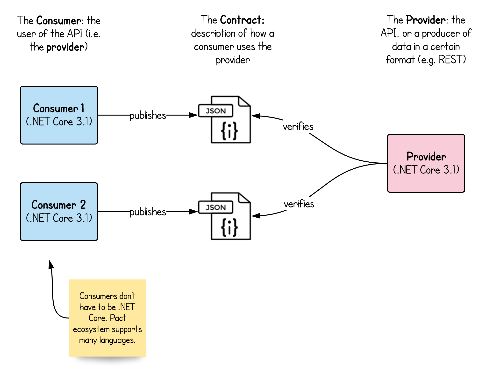

# 📜 Contract Testing example in .NET 5 and C# 8

Contract testing example with two API consumers and one API provider using PactNET. Use this repo as a guide to kick
off a conversation about how to write and honor contracts between an API and consumers of that API.

Run `ship-it.sh` to create and verify contracts between parties. Take a look for more info on parties
below in the [Scenario](#scenario) section.

## ✳️ Scenario

There is an Address Book API that serves all things related to a person's basic information. This API is
popular and now has demand from many vendors that would want to connect to it and use it seamlessly. Our goal
is to make sure that all the consumers of the API are using it without issue, and we, as maintainers of the API can
modify it, upgrade it, maintain it flawlessly. If we can create a contract between all (or some) of the vendors
using this API, we can get feedback immediately if the changes we make to the API break some consumers (or even all of them).

🏆 Goal: Satisfy the demands of all the API consumers, or **get feedback immediately** if the contract between a consumer and an API is broken.

### Navigating the code of this example

- Provider (i.e. API): `AddressBook.API`
- Provider Verification (i.e. API contract verification tests): `AddressBook.API.Tests`
- Consumer 1 (i.e. user of the API): `AddressBook.API.Consumer1.Pact`
- Consumer 2 (i.e. another user of the API): `AddressBook.API.Consumer2.Pact`

## 🤔 Gotchas

- **Launching a Test server but no endpoints are loaded** When launching a test server in your
test cases with PactNet, we use Kestrel as a standalone Http server that hosts your provider, but
we register a `TestStartup` class instead of `Startup` in AddressBook.API. The Kestrel test server
does not automatically register the controllers in the main project so it is very important to make sure
that controllers are explicitly registered in `Startup.cs`. Refer to `ConfigureServices` method in `Startup.cs`
and point your attention to `AddApplicationPart(..)` method that makes sure the controllers are registered.

## 📝 TODO or what's not covered (yet)

- Contract Testing an OAuth-protected API
- Publishing Pact contract files to a [Pact Broker](https://github.com/pact-foundation/pact_broker)
- Non-.NET Core Consumers
